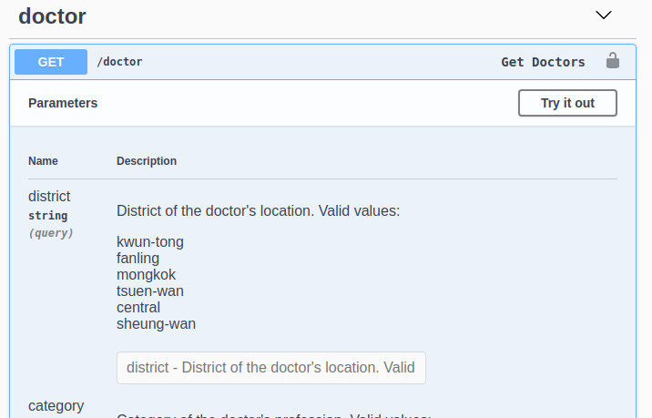
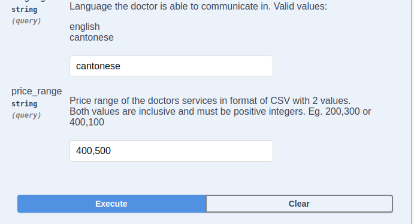
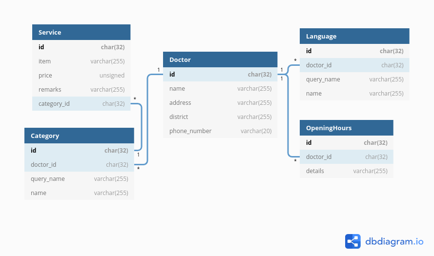

## Doctor Store for Making Doctor Queries
This Django project serves as a backend service with Restful APIs to get doctors via request.

<br/> 
<br/> 

## Set Up Project
### 1. Install required packages
```bash
pip3 install -r requirements.txt
```

### 2. Make migrations to sqlite database. Fake data will be populated to the database.
```bash
python3 manage.py migrate
```

### 3. Start project on local machine
```bash
python3 manage.py runserver
```

## Run Tests
### 1. Exceute tests with management command
```bash
python3 manage.py test
```

<br/> 
<br/>  

## Endpoints
The interactive Swagger documentaion is available at `http://127.0.0.1:8000/swagger`    
Simply click `Try it out` for each endpoint   


<br/>

Then input the parameters and click `Execute`   



<br/> 
<br/> 

### 1. Get a doctor by ID
**Endpoint:** http://127.0.0.1:8000/doctor/`uuid:doctor_id`   
**Method:** GET

**Response Body:**
```json
{
    "doctor": {
        "id": "93191810-7a02-4df0-a352-d2e8a146c112",
        "name": "陳大文",
        "address": "九龍觀塘XX街1號XX大廈1A",
        "phone_number": "21234567",
        "categories": [
            {
                "display_name": "牙科",
                "services": [
                    {
                        "item": "洗牙",
                        "price": 100,
                        "remarks": null
                    }
                ]
            }
        ],
        "languages": [
            "廣東話",
            "英語"
        ],
        "opening_hours": [
            "星期一至五:0900-1800"
        ]
    }
}
```

or 

```json
{
    "doctor_id": "4ce5922c-4209-418a-aa74-28ed05e75af3",
    "error_code": "DOCTOR_NOT_FOUND"
}
```

**Status Codes:**
| Status Code | Details |
|-|-|
| 200 | Success |
| 404 | DOCTOR_NOT_FOUND: Doctor with the ID provided is not found. |
| 500 | INTERNAL_SERVER_ERROR: Unexpected server error occured. |
 
<br/> 
<br/> 

### 2. Get a list of doctors regarding query parameters passed
**Endpoint:** http://127.0.0.1:8000/doctor   
**Method:** GET   
**Query Parameters:**
1. district: Optional, string
2. category: Optional, string
3. lanuguage: Optional, string
4. price_range: Optional, csv string. Format: `lower_limit,upper_limit`. Example: 200,300

**Response Body:**
```json
{
    "doctors": [
        {
            "id": "93191810-7a02-4df0-a352-d2e8a146c112",
            "name": "陳大文",
            "address": "九龍觀塘XX街1號XX大廈1A",
            "phone_number": "21234567",
            "categories": [
                {
                    "display_name": "牙科",
                    "services": [
                        {
                            "item": "洗牙",
                            "price": 100,
                            "remarks": null
                        }
                    ]
                }
            ],
            "languages": [
                "廣東話",
                "英語"
            ],
            "opening_hours": [
                "星期一至五:0900-1800"
            ]
        },
        {
            "id": "d0cd68b1-1329-45a4-93c3-410ee4815f00",
            "name": "林大文",
            "address": "九龍觀塘XX街99號XX大廈12C",
            "phone_number": "26234567",
            "categories": [
                {
                    "display_name": "皮膚科",
                    "services": [
                        {
                            "item": "診金",
                            "price": 280,
                            "remarks": "不包藥物"
                        }
                    ]
                }
            ],
            "languages": [
                "廣東話",
                "英語"
            ],
            "opening_hours": [
                "星期一至五:0900-1830"
            ]
        }
    ]
}
```

or 

```json
{
    "error_code": "INVALID_PRICE_RANGE"
}
```

**Status Codes:**
| Status Code | Details |
|-|-|
| 200 | Success |
| 400 | INVALID_PRICE_RANGE: Price range parameter is incorrect. |
| 500 | INTERNAL_SERVER_ERROR: Unexpected server error occured. |
<br/>  
<br/> 

## Database Schema
